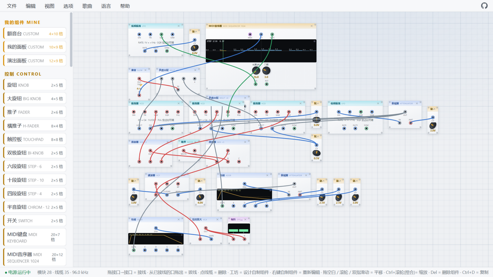

# AetherSynth · Grid Modular Subtractive Synthesizer

中文 | **English**

A pure front-end Web Audio modular synthesizer: place modules (oscillators,
filters, sequencers, drums, effects…) on a grid canvas the way you'd build a
real machine, patch them together with 3.5mm cables and make it speak — plus a
「Component Workshop」 for designing your own custom modules.

**Try it online: <https://suulnnka.github.io/AetherSynth/>**

## A look inside

The "Classic Synth Teardown · discrete build" demo from the Songs menu: three VCOs → mixer (noise included) → filter (CONTOUR envelope) → VCA → speaker, sequenced on a loop.



## Running

```bash
npm start        # dev server → http://127.0.0.1:8642
npm test         # unit tests (Node's built-in test runner, zero dependencies)
```

> ES Modules must be served over http(s) — double-clicking index.html will be
> blocked by CORS (file://).


